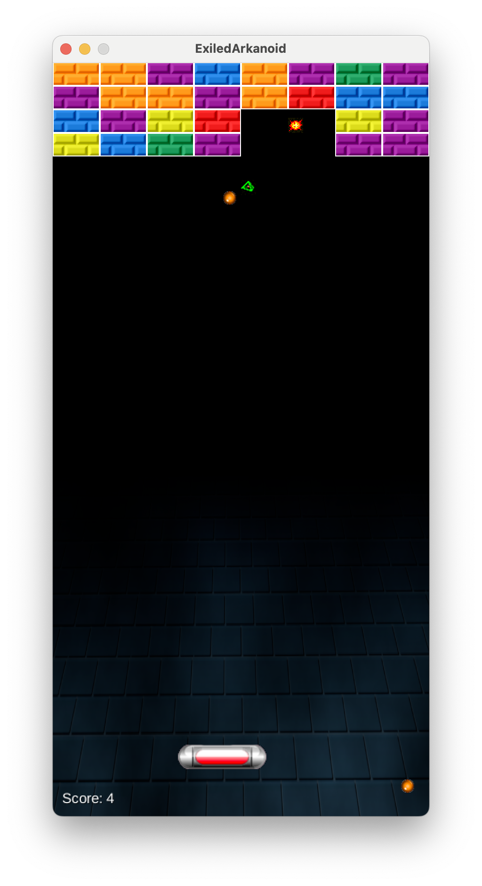

# ExiledArkanoid

A simple Arkanoid clone made with GDX and Java.

## How to run

1. Launch IntelliJ IDEA and open the project.
2. Run the `JavaArkanoid/Tasks/other/run` Gradle task.

## How to play

You can move the paddle using the mouse, but it will be temporarily disabled if you don't click on left-click.

## Illustrations

